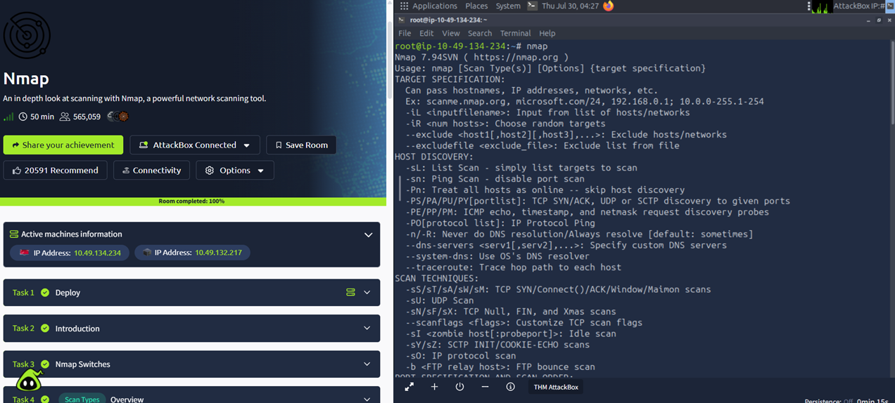
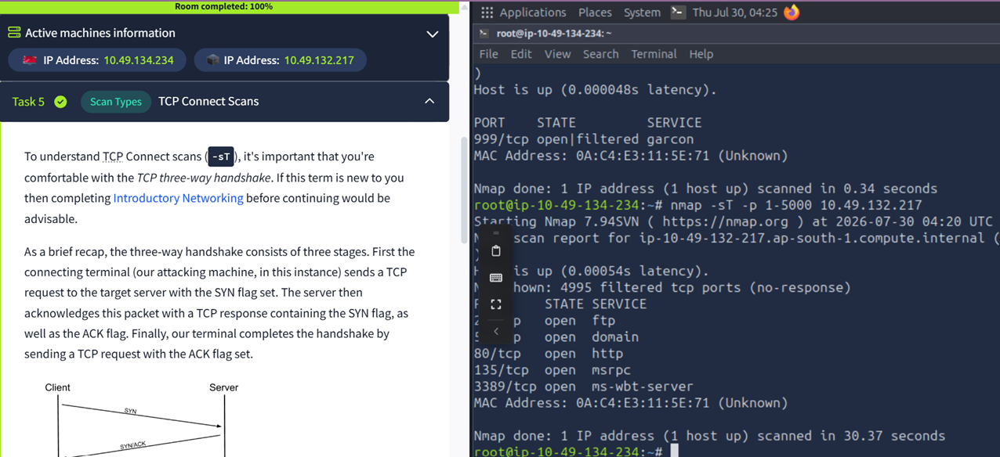

# TryHackMe - Nmap Room

## Objective

Apply Nmap fundamentals in a hands-on lab by performing different scan types, using NSE scripts, and understanding how Nmap interacts with target hosts.

---

## Platform

- **Platform:** TryHackMe
- **Room:** Nmap
- **Difficulty:** Easy

---

## Topics Covered

- Host Discovery
- TCP Connect Scan (`-sT`)
- SYN Scan (`-sS`)
- UDP Scan (`-sU`)
- NULL, FIN and Xmas Scans (`-sN`, `-sF`, `-sX`)
- Service Detection (`-sV`)
- OS Detection (`-O`)
- Nmap Scripting Engine (NSE)
- Output Formats (`-oN`, `-oX`, `-oG`, `-oA`)
- Timing Templates
- Verbose Output
- Firewall Evasion Basics

---

## Commands Practiced

```bash
nmap -sn <target>
nmap -sT <target>
nmap -sS <target>
nmap -sU <target>
nmap -sN <target>
nmap -sF <target>
nmap -sX <target>
nmap -sV <target>
nmap -O <target>
nmap -Pn <target>
nmap -p- <target>
nmap -A <target>
nmap --script ftp-anon <target>
nmap --script vuln <target>
nmap -oA assessment <target>
```

---


## Outcome

- Successfully completed the TryHackMe **Nmap** room.
- Reinforced practical knowledge of Nmap scanning techniques and command-line options.

---

## Screenshots


### Room Completion



### TCP Connect Scan


